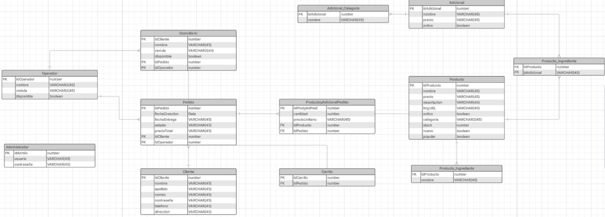
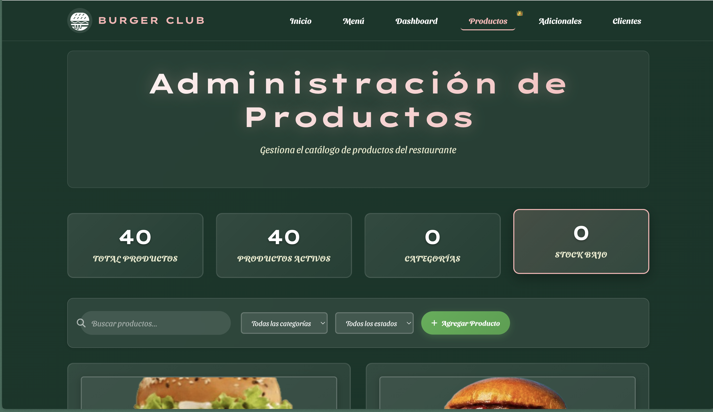

<div align="center">
  
  
  
  # 🍔 Burger Club - Sistema de Gestión de Restaurante
  
  <p><em>"La mejor experiencia gastronómica, ahora digital"</em></p>
  
  
  
  
  
  
  
  
</div>

## 📋 Descripción del Proyecto

**Burger Club** es un sistema completo de gestión para restaurantes desarrollado con **Spring Boot**. Ofrece una solución integral que permite la administración eficiente de productos, clientes, adicionales y pedidos, proporcionando tanto una interfaz intuitiva para clientes como un panel administrativo robusto y completo.

### 🎯 Características Principales

- 🍔 **Gestión Completa de Productos**: CRUD completo con categorización automática y gestión de stock
- 🔗 **Sistema Inteligente de Adicionales**: Vinculación automática por categorías compatibles
- 👥 **Gestión Avanzada de Clientes**: Registro, autenticación segura y gestión de perfiles
- 📊 **Panel Administrativo Moderno**: Dashboard interactivo con estadísticas en tiempo real
- 🔍 **Menú Dinámico**: Filtrado inteligente por categorías y búsqueda avanzada en tiempo real
- 🗄️ **Base de Datos Robusta**: Inicialización automática con datos de prueba y persistencia H2
- 🌐 **API REST Completa**: Endpoints RESTful para todas las operaciones CRUD
- 📱 **Diseño Responsive**: Interfaz completamente adaptable a móviles, tablets y desktop
- ⚡ **Alto Rendimiento**: Optimizado para respuestas rápidas y experiencia fluida
- 🔒 **Seguridad Integrada**: Validaciones robustas y manejo seguro de datos

## 🏗️ Arquitectura del Sistema

<div align="center">
  
  <br><em>Diagrama UML del Sistema Web</em>
</div>

### 📊 Modelo Entidad-Relación

<div align="center">
  
  <br><em>Modelo de Base de Datos</em>
</div>

```
📦 Burger Club
├── 🎯 Frontend (Thymeleaf + Bootstrap)
│   ├── Menú público
│   ├── Sistema de autenticación
│   └── Panel administrativo
├── ⚙️ Backend (Spring Boot)
│   ├── Controllers (REST + MVC)
│   ├── Services (Lógica de negocio)
│   ├── Repositories (Acceso a datos)
│   └── Models (Entidades JPA)
└── 🗄️ Base de Datos (H2)
    ├── Productos
    ├── Clientes
    ├── Adicionales
    └── Relaciones
```

## ⚡ Inicio Rápido

¿Quieres probar Burger Club inmediatamente? Sigue estos pasos:

```bash
# 1. Clonar y navegar al proyecto
git clone https://github.com/Santos-Arellano/website_for_restaurant.git
cd website_for_restaurant/burger-club/burgur

# 2. Ejecutar (requiere Java 17+)
./mvnw spring-boot:run

# 3. Abrir en el navegador
# http://localhost:8080
```

¡Listo! 🎉 La aplicación estará funcionando con datos de prueba.

---

## 🚀 Stack Tecnológico

<div align="center">

### 🔧 Backend
| Tecnología | Versión | Propósito |
|------------|---------|----------|
|  | 17+ | Lenguaje de programación |
|  | 3.0+ | Framework principal |
|  | 3.0+ | Persistencia de datos |
|  | 2.1+ | Base de datos en memoria |
|  | 3.6+ | Gestión de dependencias |

### 🎨 Frontend
| Tecnología | Versión | Propósito |
|------------|---------|----------|
|  | 3.0+ | Motor de plantillas |
|  | 5.0+ | Framework CSS |
|  | ES6+ | Interactividad del cliente |
|  | 5 | Estructura de páginas |
|  | 3 | Estilos y diseño |

</div>

## 🎨 Paleta de Colores

Burger Club utiliza una paleta de colores cuidadosamente seleccionada que refleja la identidad gastronómica del proyecto:

<div align="center">

| Color | Hex | Uso | Vista Previa |
|-------|-----|-----|-------------|
| **Verde Oscuro** | `#12372A` | Encabezados, navegación principal |  |
| **Rosa Suave** | `#fbb5b5` | Acentos, botones secundarios |  |
| **Verde Claro** | `#ABDC9F` | Elementos de éxito, confirmaciones |  |
| **Crema** | `#fbfada` | Fondos, áreas de contenido |  |

### 📄 Documentación Completa
Para más detalles sobre el uso de colores, consulta: [`burger-club/Paleta de colores burgur.pdf`](burger-club/Paleta%20de%20colores%20burgur.pdf)

</div>

## 📁 Estructura del Proyecto

```
src/main/java/restaurante/example/burgur/
├── 🎮 Controller/
│   ├── AdminController.java          # Panel administrativo
│   ├── AdicionalController.java      # Gestión de adicionales
│   ├── AuthController.java           # Autenticación
│   ├── ClienteController.java        # Gestión de clientes
│   ├── MenuController.java           # Menú público
│   └── ProductoController.java       # Gestión de productos
├── 🔧 Service/
│   ├── AdicionalService.java         # Interface adicionales
│   ├── AdicionalServiceImpl.java     # Implementación adicionales
│   ├── ClienteService.java           # Interface clientes
│   ├── ClienteServiceImpl.java       # Implementación clientes
│   ├── ProductoService.java          # Interface productos
│   └── ProductoServiceImpl.java      # Implementación productos
├── 🗄️ Repository/
│   ├── AdicionalesPermiXProductoRepository.java
│   ├── AdicionalRepository.java
│   ├── ClienteRepository.java
│   └── ProductoRepository.java
├── 📊 Model/
│   ├── Adicional.java                # Entidad adicionales
│   ├── AdicionalesPermiXProducto.java # Relación M:N
│   ├── Cliente.java                  # Entidad clientes
│   └── Producto.java                 # Entidad productos
├── ⚙️ Config/
│   └── DataBaseInit.java             # Inicialización de datos
└── 🚀 BurgurApplication.java         # Clase principal
```

## 🛠️ Instalación y Configuración

### 📋 Prerrequisitos

- ☕ **Java 17 o superior** - [Descargar OpenJDK](https://openjdk.org/)
- 📦 **Maven 3.6+** - [Instalar Maven](https://maven.apache.org/install.html)
- 🌐 **Navegador web moderno** (Chrome, Firefox, Safari, Edge)
- 💻 **Sistema Operativo**: Windows, macOS, o Linux

### 🚀 Pasos de Instalación

1. **📥 Clonar el repositorio**
   ```bash
   git clone https://github.com/Santos-Arellano/website_for_restaurant.git
   cd website_for_restaurant/burger-club/burgur
   ```

2. **🔧 Verificar Java y Maven**
   ```bash
   java --version
   mvn --version
   ```

3. **📦 Instalar dependencias y compilar**
   ```bash
   ./mvnw clean install
   ```

4. **▶️ Ejecutar la aplicación**
   ```bash
   ./mvnw spring-boot:run
   ```

5. **🌐 Acceder a la aplicación**
   - **🏠 Página Principal**: [http://localhost:8080](http://localhost:8080)
   - **👨‍💼 Panel Administrativo**: [http://localhost:8080/admin](http://localhost:8080/admin)
   - **🗄️ Consola H2**: [http://localhost:8080/h2-console](http://localhost:8080/h2-console)
   - **📋 Gestión de Productos**: [http://localhost:8080/admin/productos](http://localhost:8080/admin/productos)

> **💡 Tip**: La aplicación se iniciará automáticamente con datos de prueba para que puedas explorar todas las funcionalidades inmediatamente.

### Configuración de Base de Datos

```properties
# application.properties
spring.datasource.url=jdbc:h2:file:./mydatabase
spring.datasource.driverClassName=org.h2.Driver
spring.datasource.username=sa
spring.datasource.password=
spring.h2.console.enabled=true
spring.jpa.hibernate.ddl-auto=update
```

## 📚 Guía de Uso

### 👥 Para Clientes

1. **Registro/Login**
   - Crear cuenta nueva o iniciar sesión
   - Validación de datos automática

2. **Explorar Menú**
   - Filtrar por categorías
   - Buscar productos específicos
   - Ver detalles y adicionales disponibles

### 🔧 Para Administradores

1. **Dashboard**
   - Estadísticas en tiempo real
   - Resumen de productos, clientes y adicionales

2. **Gestión de Productos**
   - Crear, editar y eliminar productos
   - Gestión de stock y precios
   - Categorización automática

3. **Gestión de Adicionales**
   - Crear adicionales por categoría
   - Vinculación automática con productos

4. **Gestión de Clientes**
   - Ver lista completa de clientes
   - Editar información de clientes

## 🔌 API REST Endpoints

### Productos
```http
GET    /menu/api/productos           # Listar todos los productos
GET    /menu/api/productos/{id}      # Obtener producto por ID
POST   /menu/api/productos           # Crear nuevo producto
PUT    /menu/api/productos/{id}      # Actualizar producto
DELETE /menu/api/productos/{id}      # Eliminar producto
```

### Clientes
```http
GET    /admin/clientes/api           # Listar todos los clientes
GET    /admin/clientes/api/{id}      # Obtener cliente por ID
POST   /admin/clientes/api           # Crear nuevo cliente
PUT    /admin/clientes/api/{id}      # Actualizar cliente
DELETE /admin/clientes/api/{id}      # Eliminar cliente
```

### Adicionales
```http
GET    /admin/adicionales/api        # Listar todos los adicionales
GET    /admin/adicionales/api/{id}   # Obtener adicional por ID
POST   /admin/adicionales/api        # Crear nuevo adicional
PUT    /admin/adicionales/api/{id}   # Actualizar adicional
DELETE /admin/adicionales/api/{id}   # Eliminar adicional
```

### Autenticación
```http
POST   /auth/api/login               # Iniciar sesión
POST   /auth/api/register            # Registrar nuevo usuario
GET    /auth/api/current             # Usuario actual
```

## 🗄️ Modelo de Datos

### Entidades Principales

#### Producto
```java
- id: Long (PK)
- nombre: String
- descripcion: String
- precio: Double
- categoria: String
- imgURL: String
- stock: Integer
- nuevo: Boolean
- popular: Boolean
- activo: Boolean
- ingredientes: List<String>
```

#### Cliente
```java
- id: Long (PK)
- nombre: String
- apellido: String
- correo: String (Unique)
- contrasena: String
- telefono: String
- direccion: String
- activo: Boolean
```

#### Adicional
```java
- id: Long (PK)
- nombre: String (Unique)
- precio: Double
- activo: Boolean
- categoria: List<String>
```

### Relaciones
- **Producto ↔ Adicional**: Relación Many-to-Many a través de `AdicionalesPermiXProducto`
- **Vinculación automática**: Los adicionales se asocian automáticamente según categorías compatibles

## 🎨 Características de la Interfaz

### Diseño Responsive
- ✅ Adaptable a móviles, tablets y desktop
- ✅ Bootstrap 5 para consistencia visual
- ✅ Iconografía moderna con Font Awesome

### Panel Administrativo
- 📊 Dashboard con métricas en tiempo real
- 🔍 Búsqueda y filtrado avanzado
- ✏️ Modales para edición rápida
- 📱 Interfaz intuitiva y moderna

<div align="center">
  
  <p><em>Vista del panel administrativo con estadísticas en tiempo real</em></p>
</div>

### Menú Público
- 🍔 Visualización atractiva de productos
- 🏷️ Filtrado por categorías
- 🔍 Búsqueda en tiempo real
- 💰 Precios y descripciones claras

<div align="center">
  
  <p><em>Interfaz del menú público con filtros y catálogo de productos</em></p>
</div>

## 🔒 Seguridad y Validaciones

### Validaciones del Backend
- ✅ Validación de datos de entrada
- ✅ Sanitización de strings
- ✅ Verificación de unicidad (emails, nombres)
- ✅ Manejo de errores robusto

### Validaciones del Frontend
- ✅ Validación en tiempo real
- ✅ Mensajes de error claros
- ✅ Prevención de envíos duplicados

## 📊 Datos de Prueba

La aplicación incluye datos de prueba que se cargan automáticamente:

- **40+ Productos** distribuidos en 5 categorías
- **20 Adicionales** con categorización inteligente
- **10 Clientes** de prueba
- **Relaciones automáticas** entre productos y adicionales

### Categorías de Productos
1. 🍔 **Hamburguesas** (15 variedades)
2. 🌭 **Perros Calientes** (5 variedades)
3. 🍟 **Acompañamientos** (10 opciones)
4. 🥤 **Bebidas** (8 opciones)
5. 🍰 **Postres** (6 opciones)

## 🧪 Testing y Desarrollo

### Ejecutar en Modo Desarrollo
```bash
./mvnw spring-boot:run -Dspring-boot.run.profiles=dev
```

### Acceso a H2 Console
- **URL**: http://localhost:8080/h2-console
- **JDBC URL**: `jdbc:h2:file:./mydatabase`
- **Usuario**: `sa`
- **Contraseña**: (vacía)

## 🚀 Despliegue

### Generar JAR Ejecutable
```bash
./mvnw clean package
java -jar target/burgur-0.0.1-SNAPSHOT.jar
```

### Variables de Entorno
```bash
export SERVER_PORT=8080
export DB_URL=jdbc:h2:file:./mydatabase
export DB_USERNAME=sa
export DB_PASSWORD=
```

## 📸 Galería de Capturas

<div align="center">
  <table>
    <tr>
      <td align="center">
        
        <br><strong>Panel Administrativo</strong>
      </td>
      <td align="center">
        
        <br><strong>Menú Público</strong>
      </td>
    </tr>
    <tr>
      <td align="center">
        
        <br><strong>Diagrama UML</strong>
      </td>
      <td align="center">
        
        <br><strong>Modelo Entidad-Relación</strong>
      </td>
    </tr>
  </table>
</div>

## 🌟 Características Destacadas

<div align="center">
  <table>
    <tr>
      <td align="center" width="25%">
        <h3>🚀 Alto Rendimiento</h3>
        <p>Optimizado con Spring Boot y H2 Database para respuestas rápidas</p>
      </td>
      <td align="center" width="25%">
        <h3>📱 Responsive Design</h3>
        <p>Interfaz adaptable que funciona perfectamente en todos los dispositivos</p>
      </td>
      <td align="center" width="25%">
        <h3>🔒 Seguro y Confiable</h3>
        <p>Validaciones robustas y manejo seguro de datos de usuarios</p>
      </td>
      <td align="center" width="25%">
        <h3>⚡ Fácil de Usar</h3>
        <p>Interfaz intuitiva tanto para clientes como administradores</p>
      </td>
    </tr>
  </table>
</div>

## 🤝 Contribución

1. Fork el proyecto
2. Crear una rama para tu feature (`git checkout -b feature/AmazingFeature`)
3. Commit tus cambios (`git commit -m 'Add some AmazingFeature'`)
4. Push a la rama (`git push origin feature/AmazingFeature`)
5. Abrir un Pull Request

## 📝 Licencia

Este proyecto está bajo la Licencia MIT - ver el archivo [LICENSE](LICENSE) para más detalles.

## 👨‍💻 Autor

**Santos Arellano**
- GitHub: [@Santos-Arellano](https://github.com/Santos-Arellano)
- Email: arellanosantoso6@gmail.com
- LinkedIn: [Santos Arellano](https://linkedin.com/in/santos-arellano)

## 📈 Roadmap y Futuras Mejoras

- [ ] 🛒 **Sistema de Carrito de Compras**: Implementación completa del carrito
- [ ] 💳 **Integración de Pagos**: Pasarelas de pago (PayPal, Stripe)
- [ ] 📧 **Sistema de Notificaciones**: Email y SMS para pedidos
- [ ] 📱 **App Móvil**: Aplicación nativa para iOS y Android
- [ ] 🔔 **Notificaciones Push**: Alertas en tiempo real
- [ ] 📊 **Analytics Avanzados**: Reportes detallados de ventas
- [ ] 🌍 **Internacionalización**: Soporte multi-idioma
- [ ] 🔐 **OAuth2**: Login con Google, Facebook, GitHub

## 🤝 Contribuir al Proyecto

¡Las contribuciones son bienvenidas! Aquí te explicamos cómo puedes ayudar:

### 🐛 Reportar Bugs
1. Busca si el issue ya existe
2. Crea un nuevo issue con detalles específicos
3. Incluye pasos para reproducir el problema

### ✨ Proponer Nuevas Características
1. Abre un issue describiendo la funcionalidad
2. Explica el caso de uso y beneficios
3. Espera feedback antes de implementar

### 🔧 Proceso de Desarrollo
```bash
# 1. Fork el repositorio
# 2. Crear rama para tu feature
git checkout -b feature/nueva-caracteristica

# 3. Realizar cambios y commits
git commit -m "feat: agregar nueva característica"

# 4. Push y crear Pull Request
git push origin feature/nueva-caracteristica
```

## 🙏 Agradecimientos

- 🌱 **Spring Boot Team** - Por el excelente framework
- 🎨 **Bootstrap Team** - Por el framework CSS responsive
- ☕ **Comunidad Java** - Por el apoyo y recursos
- 🚀 **GitHub** - Por la plataforma de desarrollo colaborativo

---

<div align="center">
  
  ### 🍔 Burger Club
  
  **Desarrollado con ❤️ y ☕ por [Santos Arellano](https://github.com/Santos-Arellano)**
  
  *"La mejor experiencia gastronómica, ahora digital"*
  
  [](https://github.com/Santos-Arellano)
  [](https://linkedin.com/in/santos-arellano)
  [](mailto:arellanosantoso6@gmail.com)
  
  ---
  
  **⭐ Si te gusta este proyecto, ¡dale una estrella! ⭐**
  
</div>
</div>